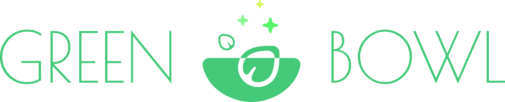
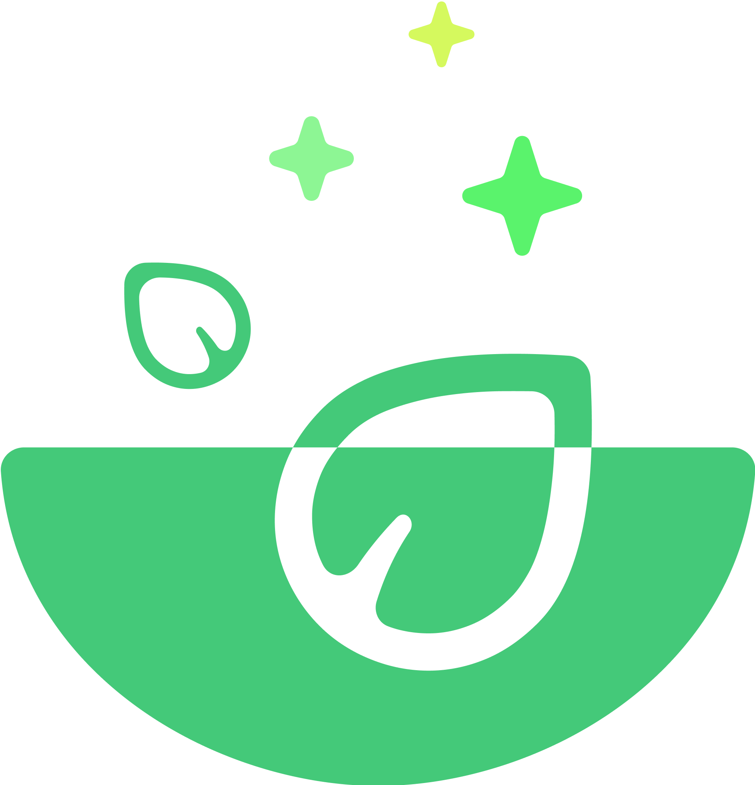

<p align="center">
  
</p>

# Green Bowl

**Green Bowl** est une _single page application_ de commande de repas en ligne. Développée avec React et Typescript.

Une [démo](https://green-bowl-4oqscgfgc-noehs-projects.vercel.app/) vaut mille mot !

## 🚀 Technologies utilisées

- **Frontend** : React + TypeScript
- **Backend** : Firestore Database
- **Styling** : Styled Components (selon implémentation)
- **Animations** : React Transition Group
- **Outils** : Vite
- **Déploiement** : Vercel

## ✨ Fonctionnalités principales

- **Mode admin** :
  - Ajouter/Modifier/Supprimer des produits du menu (CRUD)
  - Panel admin d'ajout et d'édition d'un produit
  - Gérer la disponibilité des produits
  - Ajouter de la publicité à un produit
- **E-commerce** : Ajouter/Supprimer des produits du panier
- **Interface utilisateur moderne** : Design épuré et intuitif

## 📦 Installation et démarrage

1. Clonez le dépôt :
   ```bash
   git clone https://github.com/Noeh-L/green-bowl.git
   ```
2. Accédez au répertoire du projet :
   ```bash
   cd green-bowl
   ```
3. Installez les dépendances :
   ```bash
   npm install
   ```
4. Lancez le projet en mode développement :
   ```bash
   npm run dev
   ```
5. Ouvrez votre navigateur à l'adresse suivante : [http://localhost:5173](http://localhost:5173)

## 📧 Contact

Pour toute question ou suggestion, vous pouvez me contacter par [mail](mailto:contact@noehledra.fr), ou en passant par les liens ci-dessous.

- **[Portfolio](https://www.noehledra.fr)**
- **[LinkedIn](https://www.linkedin.com/in/noeh-ledra-052179151)**
- **[Twitter](https://x.com/nano_dev0)**

##

<p align="center">
  
</p>
